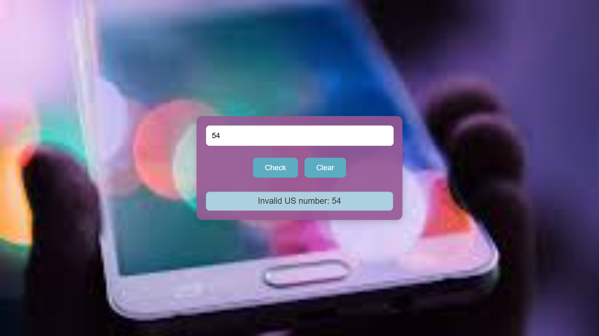

readme# Project Title 🚀
Telephone-Number-Validator
## Project Description 📝

A telephone number validator created using JavaScript, HTML, and CSS is a simple web application that allows users to input a phone number and check its validity based on specific formatting rules. The application features an input field for entering the phone number, a "Check" button to validate the input, and a "Clear" button to reset the results. It provides real-time feedback by displaying messages indicating whether the entered phone number is valid or invalid. The user interface is styled with CSS to enhance visual appeal, and JavaScript handles the validation logic and user interactions.


## Demo 📸

## Technologies Used 🛠️

- HTML
- CSS
- JS

## Installation 💻

Provide step-by-step instructions on how to install and set up your project. Include any dependencies or prerequisites that need to be installed.

```bash
# git@github.com:latifa-wakili/Telephone-Number-Validator.git.
```

```bash
# cd Telephone-Number-Validator.
```


 ```bash
# code .
```

## Usage 🎯

```bash
# use git clone .
```

## Author 👩‍💻
- Twitter: [@Latifa_Wakili](https://x.com/WakiliLatifa?t=wlHTh8JuyFprQsN_hZQGWQ&s=08)
- LinkedIn: [Latifa Wakili](https://www.linkedin.com/in/latifa-wakili-68423b277?utm_source=share&utm_campaign=share_via&utm_content=profile&utm_medium=android_app)
- Email: [Latifa Wakili](saavenwakili@gmail.com)

## Contributing 🤝
for team working at first you should creat an organization on git hub nex you can creat pull_request on your project to shear whith your team and work on it together.

